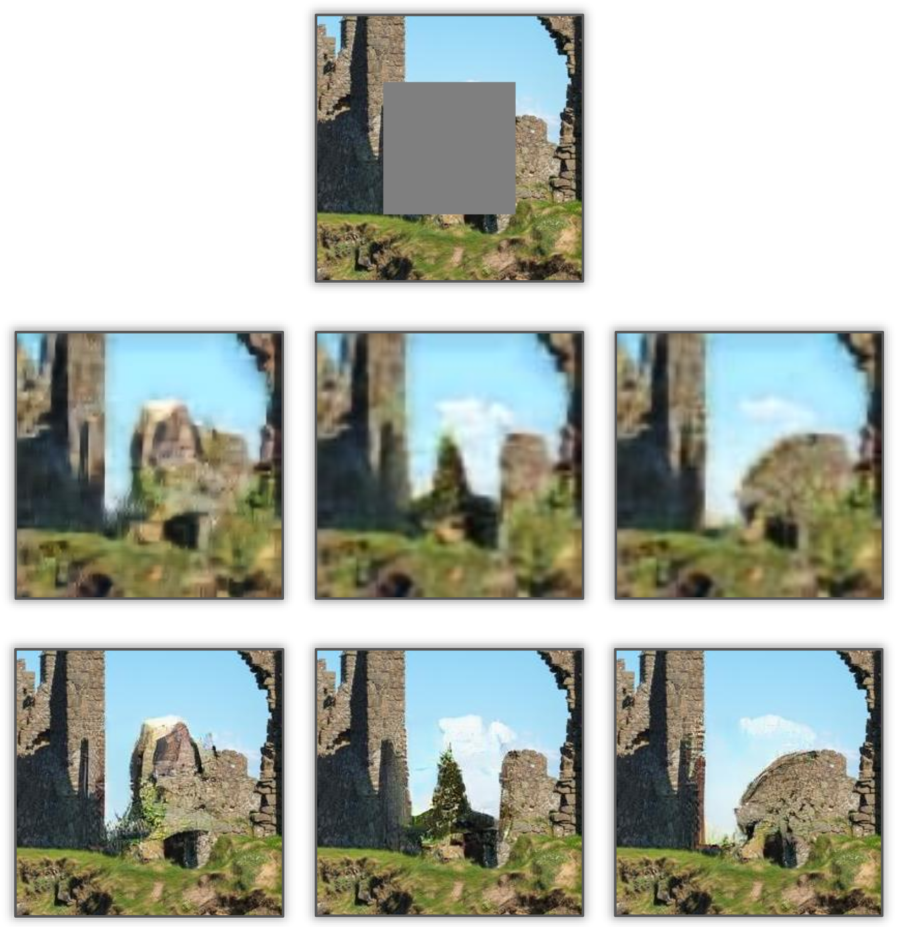

# Diverse Structure Inpainting

ArXiv | Papar | Supplementary Material | BibTex

This repository is for the CVPR 2021 paper, "Generating Diverse Structure for Image Inpainting with Hierarchical VQ-VAE".

If our method is useful for your research, please consider citing.

## Introduction
<div align=center>

</div>

*(Top) Input incomplete image, where the missing region is depicted in gray. (Middle) Visualization of the generated diverse structures. (Bottom) Output images of our method.*

## Installation
This code was tested with TensorFlow 1.12.0, CUDA 9.0, Python 3.6 and Ubuntu 16.04

Clone this repository：
```
git clone https://github.com/USTC-JialunPeng/Diverse-Structure-Inpainting.git
```

## Datasets
* [CelebA-HQ](https://github.com/tkarras/progressive_growing_of_gans): the high-resolution face images from Growing GANs. 24183 for training, 2993 images for validation and 2824 images for testing.
* [Places2](http://places2.csail.mit.edu/): the challenge data from 365 scene categories. 8 Million images for training, 36K images for validation and 328K images for testing.
* [ImageNet](http://www.image-net.org/): the data from 1000 natural categories. 1 Million images for training and 50K images for validation.

## Training
* Collect the dataset. For CelebA-HQ, we collect the 1024x1024 version. For Places2 and ImageNet, we collect the original version.
* Prepare the file list. Collect the path of each image and make a file, where each line is a path (end with a carriage return except the last line).
* Modify `checkpoints_dir`, `dataset`, `train_flist` and `valid_flist` arguments in `train_vqvae.py`, `train_structure_generator.py` and `train_texture_generator.py`.
* Modify `data/data_loader.py` according to the dataset. For CelebA-HQ, we resize each image to 266x266 and randomly crop a 256x256. For Places2 and ImageNet, we randomly crop a 256x256
* Run `python train_vqvae.py` to train VQ-VAE.
* Modify `vqvae_network_dir` argument in `train_structure_generator.py` and `train_texture_generator.py` based on the path of pre-trained VQ-VAE.
* Modify the mask setting arguments in `train_structure_generator.py` and `train_texture_generator.py` to choose center mask or random mask.
* Run `python train_structure_generator.py` to train the structure generator.
* Run `python train_texture_generator.py` to train the texture generator.
* Modify `structure_generator_dir` and `texture_generator_dir` arguments in `save_full_model.py` based on the paths of pre-trained structure generator and texture generator.
* Run `python save_full_model.py` to save the whole model.

## Testing
* Collect the testing set. For CelebA-HQ, we resize each image to 256x256. For Places2 and ImageNet, we crop a center 256x256.
* Collect the corresponding mask set (2D grayscale, 0 indicates the known region, 255 indicates the missing region). 
* Prepare the img file list and the mask file list as training.
* Modify `checkpoints_dir`, `dataset`, `img_flist` and `mask_flist` arguments in `test.py`.
* Download the pre-trained model and put `model.ckpt.meta`, `model.ckpt.index`, `model.ckpt.data-00000-of-00001` and `checkpoint` under `model_logs/` directory.
* Run `python test.py`

## Pre-trained Models
Download the pre-trained models using the following links and put them under `model_logs/` directory.

* `center_mask model`: [CelebA-HQ_center](https://drive.google.com/drive/folders/14Vskk15KUw6kYVkbyCJZw-7PUVhAiYqT) | [Places2_center](https://drive.google.com/drive/folders/1Dwi3HYC8ZDcqZvAnMQQUhMSKWOwkBTLJ) | [ImageNet_center](https://drive.google.com/drive/folders/1UanB-Yi4UkEma7tEsykjKKCKziS5Mb2Z)
* `random_mask model`: [CelebA-HQ_random](https://drive.google.com/drive/folders/1jLGVwWREwfGaKEzsr8f4IUqCCFANkFvG) | [Places2_random](https://drive.google.com/drive/folders/1h6tU-2P1j2DFAD42VntFS7XsKNRBI7__) | [ImageNet_random](https://drive.google.com/drive/folders/1ZNh9vjZGevCjUg-mF08pT6L3KZLo8MTL)

The **center_mask models** are trained with images of 256x256 resolution with center 128x128 holes. The **random_mask models** are trained with random regular and irregular holes.

## Inference Time
* One advantage that GAN-based and VAE-based methods have is their fast inference speed. We measure that [FE](https://github.com/KumapowerLIU/Rethinking-Inpainting-MEDFE) runs at 0.2 seconds per image on a single NVIDIA 1080 Ti GPU for images of resolution 256×256. In contrast, our model runs at 45 seconds per image. Naively sampling our autoregressive network is a major source of wasted time. Fortunately, this time can be reduced by an order of magnitude using an [incremental sampling technique](https://github.com/PrajitR/fast-pixel-cnn) which caches and reuses intermediate states of the network. Consider using this technique for faster inference.

